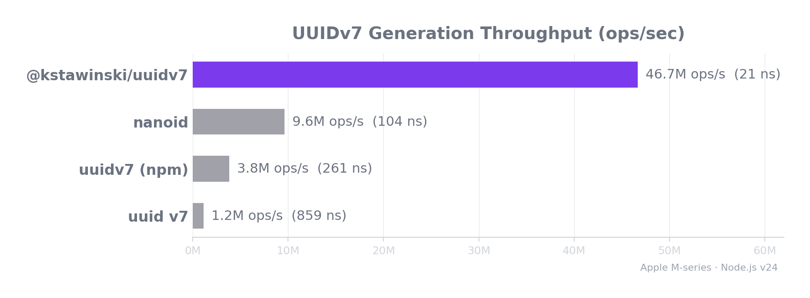

# @kstawinski/uuidv7

Ultra-fast, zero-dependency UUIDv7 generator for TypeScript & JavaScript. Fully compliant with [RFC 9562](https://www.rfc-editor.org/rfc/rfc9562).

**~21 ns/op** | **46M+ ops/sec** | **4.8x faster than nanoid** | **12x faster than uuidv7 (npm)**

## Why UUIDv7?

UUIDv4 gives you random noise. UUIDv7 gives you **time-sorted, database-friendly identifiers** that are just as unique:

- **Sortable** — IDs generated later always sort after earlier ones. `ORDER BY id` = `ORDER BY created_at`, no extra column needed.
- **Index-friendly** — monotonically increasing keys reduce B-tree page splits and improve write throughput in PostgreSQL, MySQL, SQLite, CockroachDB, and every other engine with clustered indexes.
- **Monotonic** — multiple IDs within the same millisecond are guaranteed strictly increasing via a 12-bit counter with random seeding.
- **Standard** — [RFC 9562](https://www.rfc-editor.org/rfc/rfc9562) (the IETF successor to RFC 4122), not a proprietary format.

## Features

- **46M+ ops/sec** — the fastest UUIDv7 implementation available. Outperforms even nanoid (which isn't a UUID).
- **Zero dependencies** — no runtime dependencies, ever. 2.5 KB minified.
- **Type-safe** — branded `UUIDv7` type prevents mixing with plain strings at compile time.
- **Dual format** — ships both ESM and CommonJS via `tsup`, with full `.d.ts` declarations.
- **Universal** — Node.js 18+, all modern browsers, Cloudflare Workers, Bun, Deno.

## Installation

```bash
npm install @kstawinski/uuidv7
```

<details>
<summary>Other package managers</summary>

```bash
pnpm add @kstawinski/uuidv7
yarn add @kstawinski/uuidv7
bun add @kstawinski/uuidv7
```

</details>

## Quick Start

```ts
import { uuidv7 } from '@kstawinski/uuidv7';

const id = uuidv7();
// => '019078e5-5c3a-7d1e-8f4a-3b9c0e1d2a5f'
```

## Usage

### Generate a UUIDv7 string

```ts
import { uuidv7 } from '@kstawinski/uuidv7';

const id = uuidv7();
// => '019078e5-5c3a-7d1e-8f4a-3b9c0e1d2a5f'

// IDs are always sorted — safe to use as database primary keys
const ids = Array.from({ length: 1000 }, () => uuidv7());
console.log(ids === ids.sort()); // true
```

### Generate a UUIDv7 object (with raw bytes & timestamp)

```ts
import { uuidv7obj } from '@kstawinski/uuidv7';

const { value, bytes, timestamp } = uuidv7obj();
console.log(value);     // '019078e5-5c3a-7d1e-8f4a-3b9c0e1d2a5f'
console.log(bytes);     // Uint8Array(16) [1, 144, 120, ...]
console.log(timestamp); // 1718012345678
```

### Validate a UUIDv7

```ts
import { isValid } from '@kstawinski/uuidv7';

isValid('019078e5-5c3a-7d1e-8f4a-3b9c0e1d2a5f'); // true
isValid('not-a-uuid');                              // false
isValid('550e8400-e29b-41d4-a716-446655440000');    // false (v4, not v7)
```

### Extract the timestamp

```ts
import { uuidv7, extractTimestamp } from '@kstawinski/uuidv7';

const id = uuidv7();
const ms = extractTimestamp(id);
console.log(new Date(ms)); // 2025-06-10T12:00:00.000Z

// Also works with raw bytes
const { bytes } = uuidv7obj();
extractTimestamp(bytes); // same result
```

### Type Safety with Branded Types

The `UUIDv7` type is a branded string — it's a `string` at runtime but distinct from `string` at compile time:

```ts
import { uuidv7, isValid, type UUIDv7 } from '@kstawinski/uuidv7';

function getUser(id: UUIDv7) { /* ... */ }

const id = uuidv7();     // type: UUIDv7
getUser(id);              // OK

const raw = 'some-string';
// getUser(raw);          // TS error: string is not assignable to UUIDv7

if (isValid(raw)) {
  getUser(raw);           // OK — isValid() narrows the type
}
```

## Benchmarks

<p align="center">
  
</p>

<!-- BENCHMARK_RESULTS_START -->

| Implementation | ops/sec | avg (ns) | Relative |
|---|---|---|---|
| **@kstawinski/uuidv7** | **46,682,145** | **21** | **baseline** |
| nanoid | 9,646,684 | 104 | 4.8x slower |
| uuidv7 (npm) | 3,835,111 | 261 | 12.2x slower |
| uuid v7 | 1,163,861 | 859 | 40x slower |

<!-- BENCHMARK_RESULTS_END -->

> Apple M-series, Node.js v24.4. Run `npm run bench` for your machine.

<details>
<summary>Run benchmarks yourself</summary>

```bash
git clone https://github.com/kstawinski/uuidv7
cd uuidv7
npm install
npm install uuid nanoid uuidv7   # competitors (optional)
npm run bench
```

</details>

### How is it this fast?

The hot path (same-millisecond generation) executes just **4 operations**:

1. `performance.now()` — fast ms-change detection (~22 ns, cheaper than `Date.now()`)
2. Delta comparison — skip `Date.now()` if < 0.7 ms elapsed
3. `++seq` — increment 12-bit monotonic counter
4. `prefix + VC[seq] + suffix` — 2 string concats from cached segments

Key optimizations discovered through V8 JIT profiling:

| Technique | Impact |
|---|---|
| Eliminate spin-wait overflow | +354 ns — V8 refuses to JIT-optimize functions containing `while` loops with `Date.now()` |
| `performance.now()` over `Date.now()` | +5 ns — cheaper syscall, called only for delta detection |
| Cached prefix/suffix strings | +20 ns — rebuilt once per ms, hot path does 2 concats instead of 20 |
| `VC[4096]` counter table | +5 ns — pre-computed "7xxx" hex for all 12-bit counter values |
| Class-based generator | +350 ns — V8 hidden classes optimize property access far better than module-scope `let` |
| 4096-byte entropy pool | amortizes `crypto.getRandomValues()` (675 ns) over ~409 calls |
| Timestamp-increment on counter overflow | RFC 9562 compliant, avoids spin-wait deopt |

## API Reference

### `uuidv7(): UUIDv7`

Generate a UUIDv7 string in canonical `8-4-4-4-12` format.

### `uuidv7obj(): UUIDv7Object`

Generate a UUIDv7 and return a structured object:

```ts
interface UUIDv7Object {
  value: UUIDv7;        // UUID string
  bytes: Uint8Array;    // Raw 16 bytes
  timestamp: number;    // Embedded Unix timestamp (ms)
}
```

### `isValid(uuid: string): uuid is UUIDv7`

Type guard. Returns `true` if the string is a valid UUIDv7 (correct format, version 7, variant `10xx`).

### `extractTimestamp(input: UUIDv7 | Uint8Array): number`

Extract the 48-bit millisecond timestamp. Returns `-1` for invalid input.

### `type UUIDv7 = string & { readonly __brand: 'UUIDv7' }`

Branded type for compile-time safety. A `UUIDv7` is a `string` at runtime, but TypeScript treats it as a distinct type.

## RFC 9562 Compliance

This implementation follows [RFC 9562 Section 5.7](https://www.rfc-editor.org/rfc/rfc9562#section-5.7) (UUIDv7) and [Section 6.2](https://www.rfc-editor.org/rfc/rfc9562#section-6.2) (Monotonicity and Counters):

```
 0                   1                   2                   3
 0 1 2 3 4 5 6 7 8 9 0 1 2 3 4 5 6 7 8 9 0 1 2 3 4 5 6 7 8 9 0 1
+-+-+-+-+-+-+-+-+-+-+-+-+-+-+-+-+-+-+-+-+-+-+-+-+-+-+-+-+-+-+-+-+
|                          unix_ts_ms                           |
+-+-+-+-+-+-+-+-+-+-+-+-+-+-+-+-+-+-+-+-+-+-+-+-+-+-+-+-+-+-+-+-+
|          unix_ts_ms           |  ver  |       rand_a          |
+-+-+-+-+-+-+-+-+-+-+-+-+-+-+-+-+-+-+-+-+-+-+-+-+-+-+-+-+-+-+-+-+
|var|                        rand_b                             |
+-+-+-+-+-+-+-+-+-+-+-+-+-+-+-+-+-+-+-+-+-+-+-+-+-+-+-+-+-+-+-+-+
|                            rand_b                             |
+-+-+-+-+-+-+-+-+-+-+-+-+-+-+-+-+-+-+-+-+-+-+-+-+-+-+-+-+-+-+-+-+
```

- **48-bit `unix_ts_ms`** — millisecond Unix epoch timestamp
- **4-bit `ver`** — always `0111` (version 7)
- **12-bit `rand_a`** — monotonic counter, randomly seeded per ms
- **2-bit `var`** — always `10` (RFC variant)
- **62-bit `rand_b`** — cryptographic random from `crypto.getRandomValues()`

On counter overflow (> 4095 IDs in the same ms), the timestamp is incremented by 1 ms and the counter is reseeded — maintaining strict monotonicity without blocking.

## License

[MIT](./LICENSE)
